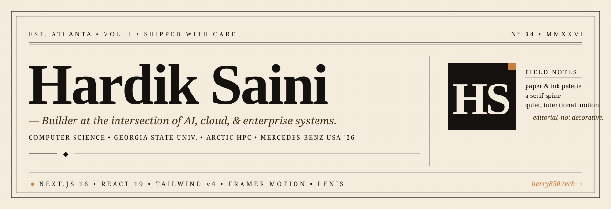

<div align="center">

<a href="https://www.harry830.tech">
  
</a>

<br />

[](https://www.harry830.tech)
[](https://nextjs.org/)
[](https://react.dev/)
[](https://tailwindcss.com/)
[](https://www.framer.com/motion/)

<br />

[**↗&nbsp;&nbsp;Visit&nbsp;the&nbsp;site**](https://www.harry830.tech) &nbsp;·&nbsp;
[**Read&nbsp;the&nbsp;about&nbsp;page**](https://www.harry830.tech/about) &nbsp;·&nbsp;
[**Get&nbsp;in&nbsp;touch**](mailto:hardiksaini830@gmail.com)

</div>

<p align="center"><sub>— ◆ —</sub></p>

> *“A handcrafted personal site — paper-and-ink palette, a typographic spine, and motion that supports the work rather than performing for it.”*

<br />

<table align="center">
<tr>
<td align="center" width="33%">
<sub>THE&nbsp;BUILDER</sub><br/>
<b>Hardik&nbsp;Saini</b><br/>
<sub>Atlanta · CS @ GSU</sub>
</td>
<td align="center" width="33%">
<sub>THE&nbsp;CRAFT</sub><br/>
<b>Editorial&nbsp;Portfolio</b><br/>
<sub>Next.js&nbsp;16 · React&nbsp;19</sub>
</td>
<td align="center" width="33%">
<sub>THE&nbsp;NEXT&nbsp;CHAPTER</sub><br/>
<b>Mercedes-Benz&nbsp;USA</b><br/>
<sub>SAP & Innovation · Summer&nbsp;'26</sub>
</td>
</tr>
</table>

---

## ✦ &nbsp;The Story

Think of this as a **personal letterpress** — a site composed like an editorial spread. A serif spine. A paper-and-ink palette. Generous whitespace. Motion that *supports* the content rather than performing for it.

Built by **Hardik Saini** — Computer Science junior at **Georgia State University**, member of the **ARCTIC HPC** team, and incoming **Mercedes-Benz USA** SAP & Innovation intern (Summer 2026).

> 🌐 &nbsp; Live at **[www.harry830.tech](https://www.harry830.tech)**

---

## ✦ &nbsp;A Walk Through the Spread

| &nbsp; | Section | What lives here |
|:---:|---|---|
| 𝟏 | **Hero** | Display-serif identity card with role-cycling and an ambient marquee. |
| 𝟐 | **Mercedes Feature** | Editorial spotlight on the incoming MBUSA internship. |
| 𝟑 | **Selected Work** | Horizontally scrolling case studies — Stockd, RoomieManager, TaskTrail, Speech Mate, Department Assistant. |
| 𝟒 | **Experience** | Roles, programs, and the timeline behind them. |
| 𝟓 | **About** | Long-form bio, programs, professional development, skills, education, and awards. |
| 𝟔 | **Contact** | EmailJS-backed form with reCAPTCHA, plus direct channels. |

---

## ✦ &nbsp;Tech Stack &nbsp;·&nbsp; The Field Kit

<table>
<tr>
<th align="left" width="33%">Foundation</th>
<th align="left" width="33%">Look & Feel</th>
<th align="left" width="33%">Comms & Plumbing</th>
</tr>
<tr valign="top">
<td>

- [Next.js 16](https://nextjs.org/) · App Router
- [React 19](https://react.dev/)
- [Sass / SCSS](https://sass-lang.com/)
- `next/font` — **Inter** + **Fraunces**

</td>
<td>

- [Tailwind CSS v4](https://tailwindcss.com/)
- [Framer Motion](https://www.framer.com/motion/)
- [Lenis](https://github.com/darkroomengineering/lenis) smooth scroll
- [react-fast-marquee](https://www.react-fast-marquee.com/)
- [Lottie React](https://lottiereact.com/)

</td>
<td>

- [EmailJS](https://www.emailjs.com/) (browser)
- [Nodemailer](https://nodemailer.com/)
- [react-google-recaptcha](https://github.com/dozoisch/react-google-recaptcha)
- [react-toastify](https://fkhadra.github.io/react-toastify/)
- [Sharp](https://sharp.pixelplumbing.com/) · [Axios](https://axios-http.com/)

</td>
</tr>
</table>

<sub>Telemetry: [Vercel Analytics](https://vercel.com/analytics) · [Google Tag Manager](https://www.npmjs.com/package/@next/third-parties)</sub>

---

## ✦ &nbsp;Design Highlights

```
┌─ paper & ink ────────────────────────────────────────────────┐
│                                                              │
│   ◆  Bold-classic visual system — Fraunces × Inter           │
│   ◆  Variable-axis serifs (SOFT, opsz) used with intent      │
│   ◆  Editorial layouts — horizontal scroller, quiet seams    │
│   ◆  Mobile-first — fluid grids, large tap targets           │
│   ◆  Considered motion — Lenis + Framer Motion, never noise  │
│   ◆  A11y — landmarks, reduced-motion, skip-link             │
│                                                              │
└──────────────────────────────────────────────────────────────┘
```

---

## ✦ &nbsp;Local Development

This repo ships with a `pnpm-lock.yaml`, so **pnpm is recommended**. A `package-lock.json` is also present, so npm works as a fallback.

```bash
# 1. install
pnpm install
# or
npm install

# 2. dev (webpack)
pnpm dev

# 2b. or dev with Turbopack
pnpm dev:turbo

# 3. production build
pnpm build           # webpack
pnpm build:turbo     # turbopack

# 4. start the production server
pnpm start
```

Open **[http://localhost:3000](http://localhost:3000)** once the dev server is running.

> [!NOTE]
> A `lint` script (`next lint`) is defined in `package.json`, but the Next.js 16 lint command has migrated and is not currently wired up in this repo. Treat `pnpm build` as the source of truth for validation.

---

## ✦ &nbsp;Project Structure

```
portfolio/
├── app/
│   ├── about/                 # /about route
│   ├── components/
│   │   ├── effects/           # preloader, scroll-progress, marquee
│   │   ├── helper/
│   │   ├── homepage/          # hero, mercedes-feature, horizontal-work,
│   │   │                      # experience, about, programs, skills,
│   │   │                      # education, awards, contact, …
│   │   ├── providers/         # smooth-scroll (Lenis)
│   │   ├── navbar.jsx
│   │   └── footer.jsx
│   ├── css/                   # global SCSS
│   ├── layout.js              # fonts, analytics, providers
│   └── page.js                # homepage composition
├── utils/
│   ├── data/                  # personal, projects, experience, skills, …
│   ├── check-email.js
│   ├── skill-image.js
│   └── time-converter.js
├── public/
│   ├── image/projects/        # case-study artwork
│   ├── profile.jpg
│   └── Hardik Saini Resume.pdf
├── docs/
│   └── assets/                # README-only artwork (this hero, etc.)
├── next.config.js
├── tailwind.config.js
├── postcss.config.js
└── package.json
```

---

## ✦ &nbsp;Quality & Validation

| Check | Command | Status |
|---|---|---|
| Production build | `pnpm build` | source of truth |
| Type / runtime | Next.js 16 + React 19 | ✓ |
| Lint | `pnpm lint` | ⚠︎ pending Next 16 lint command migration |

---

## ✦ &nbsp;The Author

<table>
<tr>
<td valign="top">

**Hardik Saini** — Builder. Atlanta, GA.

A computer science junior who likes shipping things that feel as considered as they look. Currently working on AI, cloud, and enterprise systems — and reading anything with good kerning.

</td>
<td valign="top" align="right">

[](https://www.harry830.tech)
[](https://github.com/harry830)
[](https://www.linkedin.com/in/hardiksaini830/)
[](https://leetcode.com/u/harry830/)
[](mailto:hardiksaini830@gmail.com)

</td>
</tr>
</table>

---

<div align="center">

<sub>◆</sub>

<sub><b>Designed and built by Hardik Saini.</b> &nbsp;·&nbsp; Crafted with care, shipped with momentum.</sub>

<sub><i>If this README made you smile, the site will too — [www.harry830.tech](https://www.harry830.tech)</i></sub>

</div>
